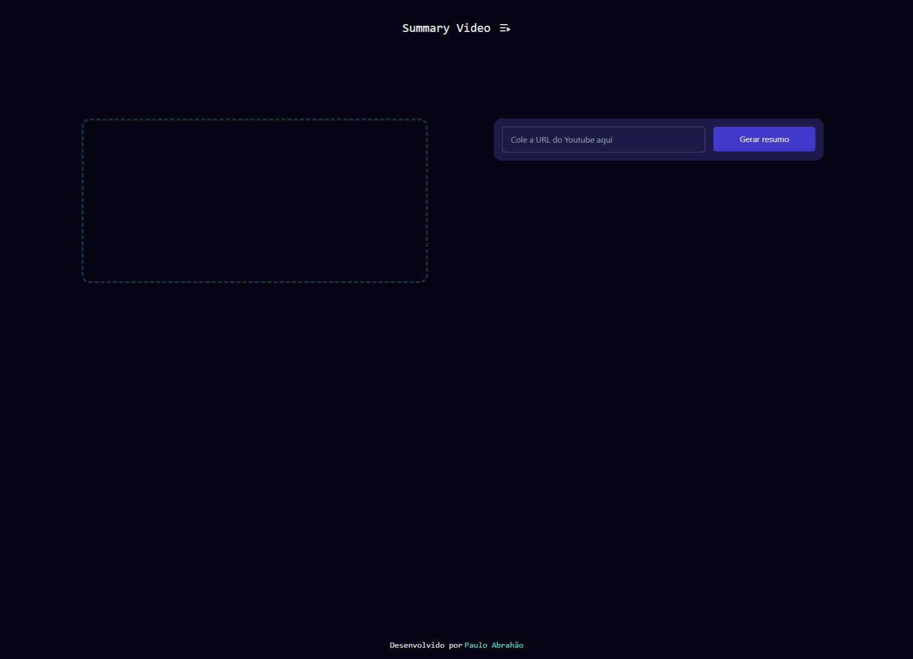
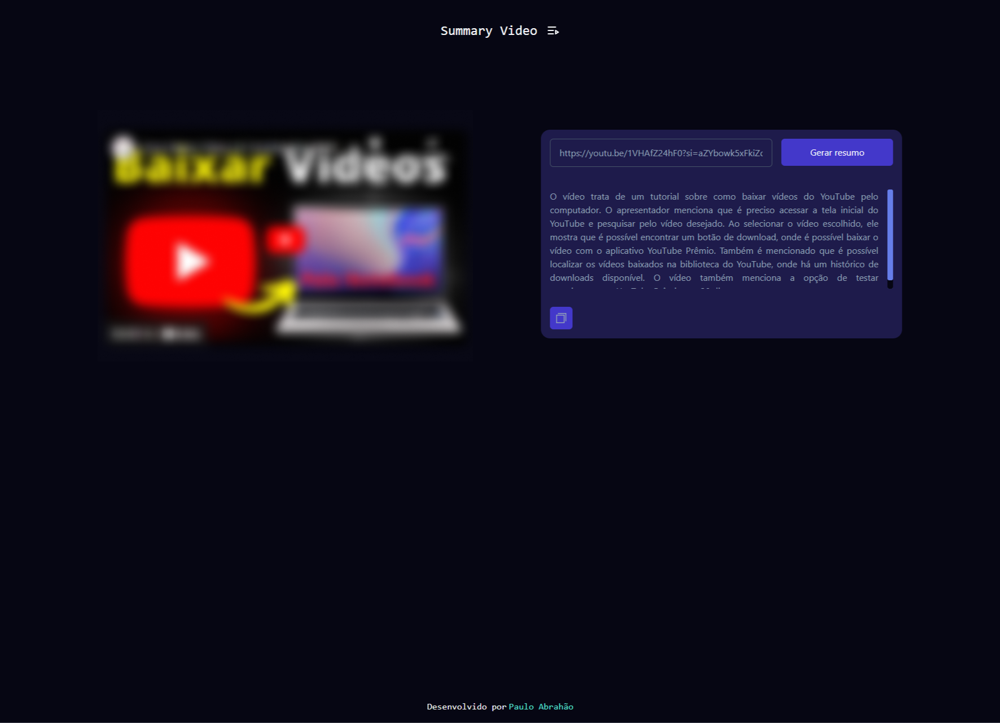

# Summary Video

<h2> Sobre </h2>
<h3> Summary Video é um aplicativo web para gerar resumos de vídeos do youtube. </h3>

## Instalação

Para rodar essa aplicação em sua máquina, primeiro clone o repositório:

```bash
  git clone https://github.com/PauloAbrahao/Summary-Video.git
```

Então, navegue para o repositório e instale as dependências:

```bash
  cd summary-video
```

```bash
  npm install
```

Finalmente, inicie a aplicação (Vite js):

```bash
  npm run dev
```

<p align="center">
  
  
</p>

## 💻 Tecnologias usadas nesse projeto:

- React JS
- Typescript
- Tailwind Css
- Open AI api
- Transformers js